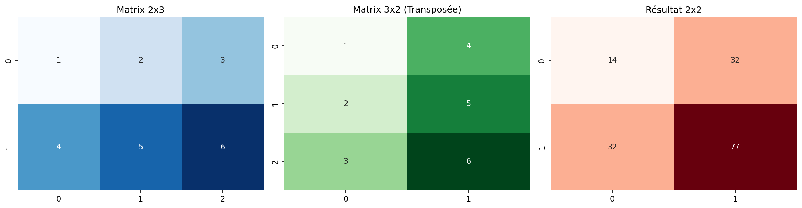
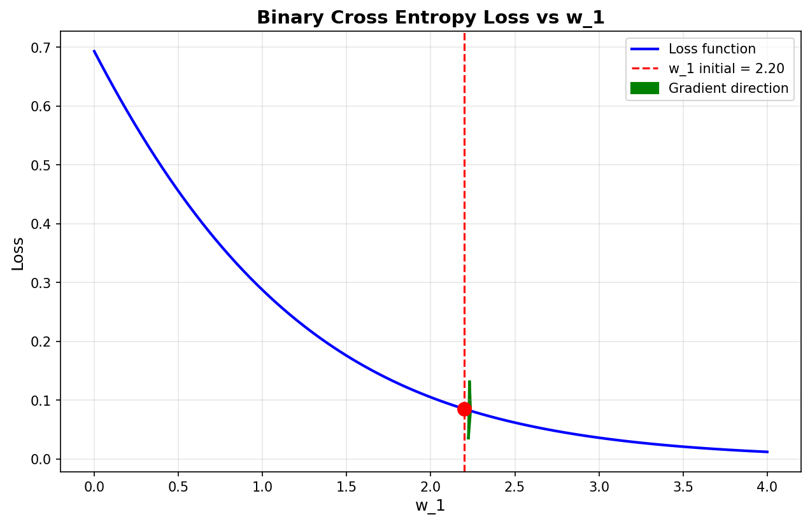
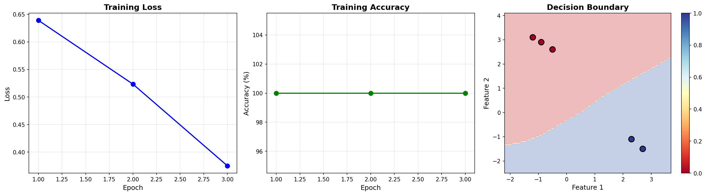

# TP0 - PyTorch Basics - Rapport

## Introduction

Ce TP couvre les fondamentaux de PyTorch nécessaires pour le deep learning : manipulation de tenseurs, calcul de gradients, création de réseaux de neurones, et gestion des devices (CPU/GPU).

---

## Partie 1 : Matrices et Tenseurs

### Objectif
Maîtriser la création et manipulation de tenseurs multi-dimensionnels.

### Résultats obtenus

**Version PyTorch :** 2.7.1+cu118 ✓

**Création de tenseurs :**
- Scalar (0D) : forme []
- Vector (1D) : forme [4]
- Matrix (2D) : forme [2, 2]
- Tensor 3D : forme [2, 2, 2]

**torch.tensor() vs torch.from_numpy() :**
- torch.tensor() : crée une COPIE indépendante
- torch.from_numpy() : partage la MÉMOIRE avec numpy
- Modification du numpy array : seul from_numpy() est affecté (valeur 999)

**reshape() vs view() :**
- reshape() : peut copier les données si nécessaire
- view() : requiert une mémoire contiguë, plus rapide mais plus restrictif

**Multiplication matricielle :**
- 2x3 @ 3x2 = 2x2
- Résultat : [[14, 32], [32, 77]]

### Visualisation


3 heatmaps montrant :
1. Matrice originale 2x3
2. Transposée 3x2
3. Résultat de la multiplication 2x2

---

## Partie 2 : Gradients

### Objectif
Comprendre le calcul automatique de gradients pour l'optimisation.

### Résultats obtenus

**Forward pass :**
- Input : x_1 = 1.1, w_1 = 2.2, b = 0.0
- z = x_1 * w_1 + b = 2.42
- a = sigmoid(z) = 0.918
- loss = BCE(a, 1.0) = 0.0852

**Calcul des gradients :**
- Méthode 1 : torch.autograd.grad()
  - grad(loss, w_1) = -0.0898
  - grad(loss, b) = -0.0817
  
- Méthode 2 : loss.backward()
  - w_1.grad = -0.0898 (identique)
  - b.grad = -0.0817 (identique)

**Paramètre retain_graph :**
Permet de recalculer les gradients plusieurs fois sans recréer le graphe computationnel.

**Interprétation des gradients :**
- w_1.grad négatif → diminuer w_1 pour réduire la loss
- La flèche verte sur le graphique montre la direction de descente

### Visualisation


Graphique montrant :
- Courbe bleue : évolution de la loss selon w_1
- Point rouge : position actuelle (w_1 = 2.2)
- Flèche verte : direction du gradient (descente)

---

## Partie 3 : Réseaux de Neurones

### Objectif
Créer, entraîner et sauvegarder un réseau de neurones.

### Architecture du modèle

**NeuralNetwork :**
- Input : dimension variable
- Hidden layer 1 : 30 neurones + ReLU
- Hidden layer 2 : 20 neurones + ReLU
- Output : dimension variable

**Exemple 50 → 3 :**
- Paramètres totaux : 2,213
  - Layer 1 : 1,500 poids + 30 biais
  - Layer 2 : 600 poids + 20 biais
  - Layer 3 : 60 poids + 3 biais

### Dataset et DataLoader

**Données d'entraînement :**
- 5 exemples, 2 features, 2 classes
- Classe 0 : points en haut à gauche (x1<0, x2>0)
- Classe 1 : points en bas à droite (x1>0, x2<0)

**DataLoader :**
- batch_size = 2
- shuffle = True pour le train
- drop_last = True élimine le dernier batch incomplet

### Entraînement

**Configuration :**
- Optimizer : SGD (lr=0.1)
- Loss : CrossEntropyLoss
- Epochs : 3

**Résultats par epoch :**
- Epoch 1 : Loss = 0.6390, Accuracy = 100.00%
- Epoch 2 : Loss = 0.5233, Accuracy = 100.00%
- Epoch 3 : Loss = 0.3750, Accuracy = 100.00%

**Accuracy finale :**
- Train : 100.00% (5/5 correct)
- Test : 50.00% (1/2 correct)

**Analyse :**
L'écart train/test indique un surapprentissage (overfitting) :
- Dataset trop petit (5 exemples)
- Modèle trop complexe (2,213 paramètres)
- Ratio : 442 paramètres par exemple
- Le modèle mémorise au lieu de généraliser

### Sauvegarde et chargement

**Sauvegarde :**
```python
torch.save(model.state_dict(), 'models/model.pth')
```

**Chargement :**
```python
model_loaded = NeuralNetwork(2, 2)
model_loaded.load_state_dict(torch.load('models/model.pth'))
```

**Vérification :** Prédictions identiques entre modèle original et modèle chargé ✓

### Visualisation


3 graphiques :
1. Loss décroissante (apprentissage effectif)
2. Accuracy à 100% (convergence rapide)
3. Decision boundary (frontière de décision linéaire séparant les 2 classes)

---

## Partie 4 : Devices

### Objectif
Gérer l'exécution sur différents devices (CPU/CUDA/MPS).

### Résultats obtenus

**Devices disponibles :**
- CUDA : False (pas de GPU NVIDIA)
- MPS : False (pas de Apple Silicon)
- CPU : True ✓

**Device sélectionné :** CPU

### Entraînement sur CPU

**Configuration :**
- Modèle : SimpleNet (2 → 30 → 20 → 2)
- Données : 5 exemples
- Epochs : 50

**Résultats :**
- Epoch 10 : Loss = 0.1359, Acc = 100%
- Epoch 20 : Loss = 0.0334, Acc = 100%
- Epoch 30 : Loss = 0.0162, Acc = 100%
- Epoch 40 : Loss = 0.0101, Acc = 100%
- Epoch 50 : Loss = 0.0072, Acc = 100%

**Temps d'entraînement :** 0.0378 secondes

### Transfert de données

**Syntaxe :**
```python
X_train = X_train.to(device)
model = model.to(device)
```

**Important :** Modèle et données doivent être sur le même device pour les calculs.

---

## Conclusions

### Compétences acquises

1. **Manipulation de tenseurs :**
   - Création et transformation de matrices
   - Différence entre copie et vue mémoire

2. **Calcul de gradients :**
   - Backpropagation automatique
   - Interprétation des gradients pour l'optimisation

3. **Réseaux de neurones :**
   - Architecture séquentielle
   - Training loop complet
   - Sauvegarde/chargement de modèles

4. **Gestion des devices :**
   - Détection automatique CPU/GPU
   - Transfert de données et modèles

### Points clés à retenir

- **torch.tensor()** copie, **torch.from_numpy()** partage
- **Gradients négatifs** → diminuer le paramètre
- **Overfitting** = train accuracy >> test accuracy
- **Device consistency** = modèle et données sur même device

### Limites identifiées

- Dataset trop petit pour évaluation fiable
- Modèle trop complexe pour le problème
- Pas de GPU disponible pour tester CUDA

### Fichiers générés

- outputs/tp0_matrices.png
- outputs/tp0_gradients.png
- outputs/tp0_training.png
- models/model.pth
