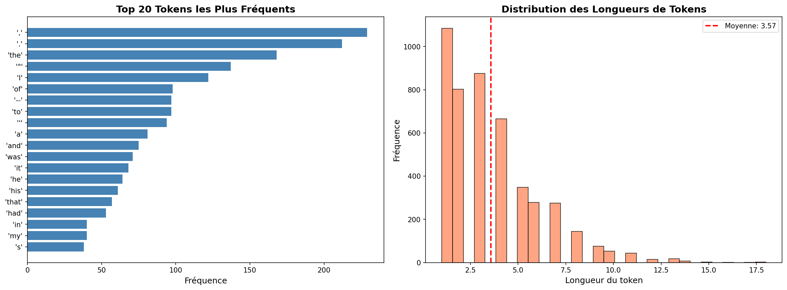
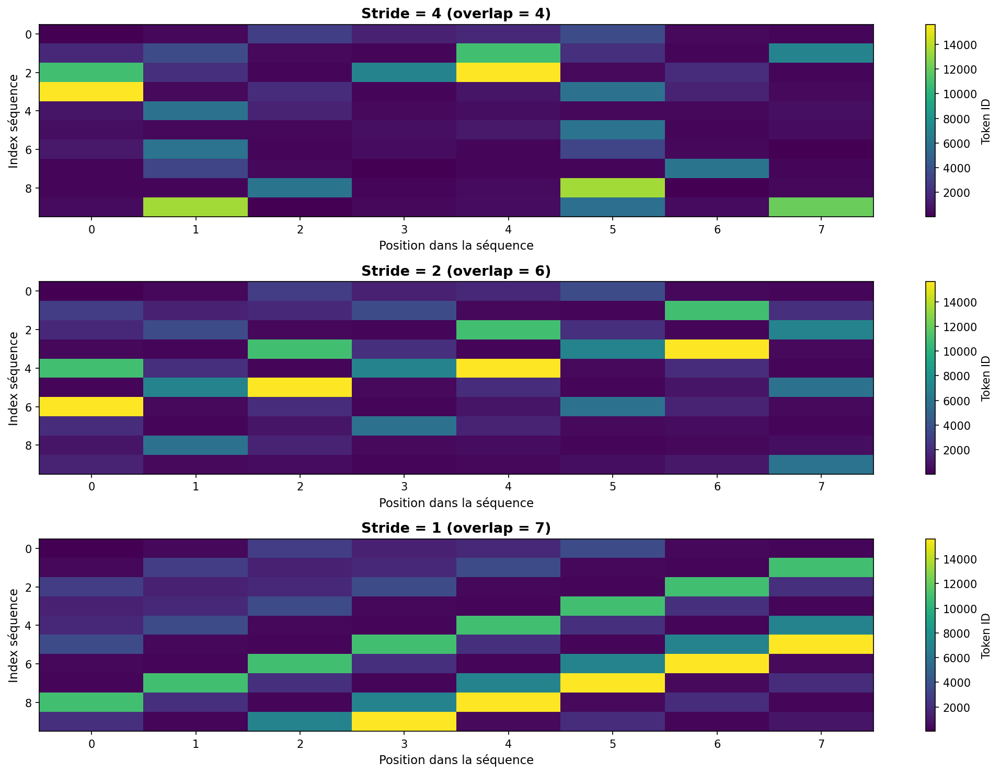
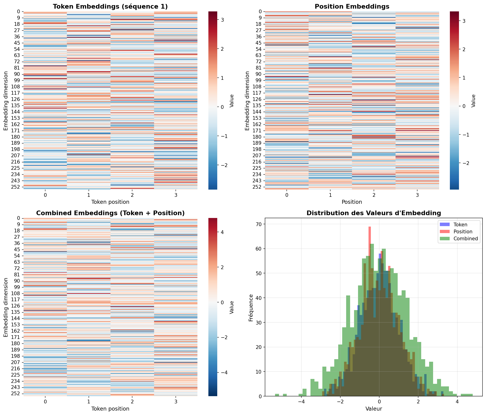
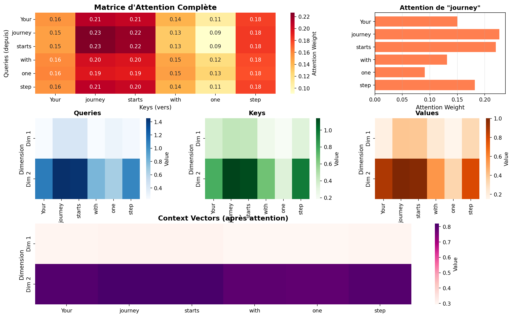
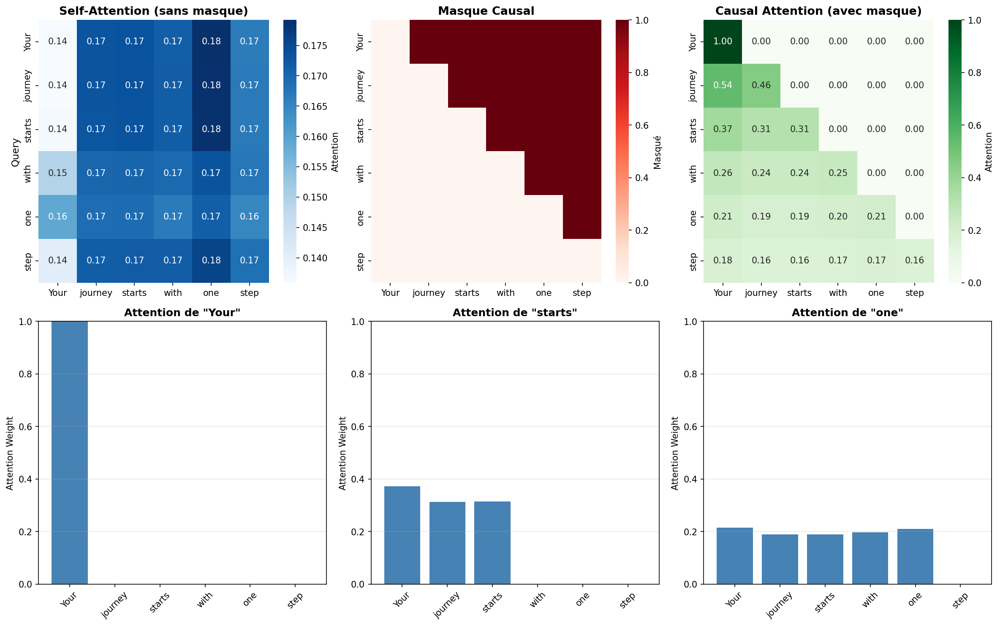
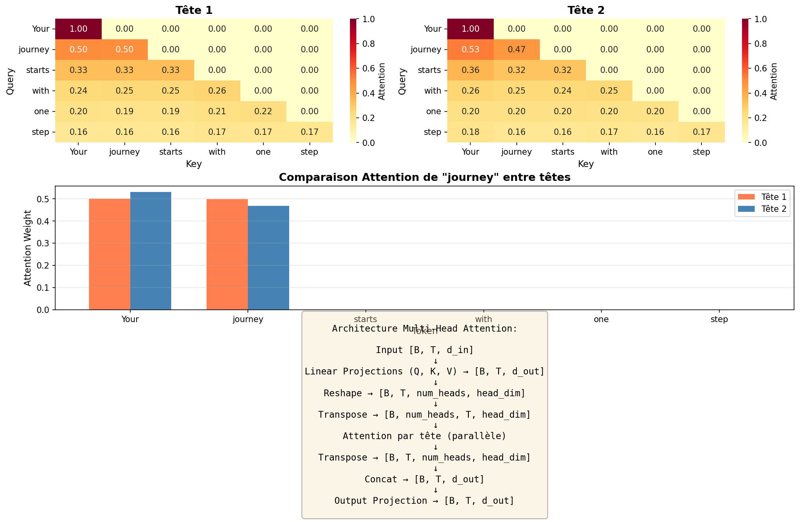

# TP1 - Tokenizers & Attention - Rapport

## Introduction

Ce TP implémente les composants fondamentaux de GPT-2 : tokenization, embeddings, et mécanismes d'attention. L'objectif est de comprendre comment un transformer traite le texte.

---

## Partie 1 : Tokenizers

### Objectif
Comprendre comment transformer du texte en séquences de nombres (tokens).

### Texte source

**Fichier :** the-verdict.txt
**Taille :** 20,479 caractères
**Extrait :** "I HAD always thought Jack Gisburn rather a cheap genius..."

### Tokenizer Simple (Whitespace)

**Méthode :** Split sur les espaces
**Résultat sur 299 caractères :**
- 109 tokens
- Inclut les espaces comme tokens séparés
- Problème : "genius--though" reste un seul token

### Tokenizer Avancé (Whitespace + Ponctuation)

**Méthode :** Split sur espaces ET ponctuation (,.:;?!"()' --)
**Résultat sur 299 caractères :**
- 65 tokens (bien moins !)
- "genius--though" devient 3 tokens : ["genius", "--", "though"]
- Meilleure granularité

### Statistiques sur le texte complet

**Avec tokenizer avancé :**
- Total tokens : 4,690
- Tokens uniques : 1,130
- Vocabulaire créé : 1,130 entrées (triées alphabétiquement)

**Top tokens :**
- Ponctuation : !, ", ', (, ), ,, --, ., :, ;, ?
- Mots : A, Ah, Among, And, Are...

### SimpleTokenizerV1

**Fonctionnalités :**
- encode(text) → list[int]
- decode(list[int]) → text

**Exemple :**
```
Input  : "It's the last he painted, you know,"
Encoded: [1, 56, 2, 850, 988, 602, 533, 746, 5, 1126, 596, 5]
Decoded: " It' s the last he painted, you know,"
```

**Problème :** KeyError sur mots inconnus (ex: "Hello")

### SimpleTokenizerV2

**Amélioration :** Ajout de tokens spéciaux
- `<|unk|>` (ID 1132) : mots inconnus
- `<|endoftext|>` (ID 1130) : séparateur de documents

**Exemple :**
```
Input  : "Hello, do you like tea? <|endoftext|> In the sunlit terraces of the palace."
Encoded: [1132, 5, 355, 1126, 628, 975, 10, 1130, 55, 988, 956, 984, 722, 988, 1132, 7]
Decoded: "<|unk|>, do you like tea? <|endoftext|> In the sunlit terraces of the <|unk|>."
```

"Hello" et "palace" → `<|unk|>` car absents du vocabulaire

### GPT-2 BytePair Encoding (BPE)

**Tokenizer officiel via tiktoken**
- Vocab size : 50,257 tokens
- Beaucoup plus efficace que notre tokenizer simple

**Même exemple :**
```
Encoded: [15496, 11, 466, 345, 588, 8887, 30, 220, 50256, 554, 262, 4252, 18250, 8812, 2114, 1659, 617, 34680, 27271, 13]
Decoded: "Hello, do you like tea? <|endoftext|> In the sunlit terracesof someunknownPlace."
```

Tous les mots sont reconnus (pas de `<|unk|>`)

### Visualisation


**Graphique gauche :** Top 20 tokens les plus fréquents
- Virgule (,) en tête
- Point (.) en 2e
- Puis mots courants : the, I, a...

**Graphique droite :** Distribution des longueurs
- Pic à 2-4 caractères (mots courts)
- Moyenne : 3.57 caractères
- Queue longue jusqu'à 15+ caractères

---

## Partie 2 : Dataset & DataLoader

### Objectif
Créer un dataset pour l'entraînement de modèles de langage.

### GPTDatasetV1

**Principe : Fenêtre glissante**
- Découpe le texte en séquences de longueur fixe (max_length)
- Décalage entre séquences : stride
- Input : séquence de tokens
- Target : même séquence décalée de 1 (pour prédiction next token)

**Exemple (max_length=4, stride=4) :**
```
Inputs : [40, 367, 2885, 1464]  → "I HAD always"
Targets: [367, 2885, 1464, 1807] → " HAD always thought"
```

Le modèle apprend à prédire le token suivant

### create_dataloader_v1

**Fonction complète créant :**
1. Tokenizer GPT-2 (tiktoken)
2. Dataset (GPTDatasetV1)
3. DataLoader (PyTorch)

**Paramètres :**
- batch_size : nombre de séquences par batch
- max_length : longueur des séquences
- stride : décalage entre séquences
- shuffle : mélanger les données (True pour train)

### Test avec max_length=stride=4

**Résultats :**
- Dataset size : 1,286 séquences
- Batches : 160 (avec batch_size=8)
- Pas d'overlap (stride = max_length)

**Premier batch (8 séquences de 4 tokens) :**
```
Inputs:  [40, 367, 2885, 1464], [1807, 3619, 402, 271], ...
Targets: [367, 2885, 1464, 1807], [3619, 402, 271, 10899], ...
```

### Impact du stride

**Stride = 4 (pas d'overlap) :**
- 1,286 séquences
- Chaque token apparaît 1 fois

**Stride = 2 (overlap de 6) :**
- 2,571 séquences (2x plus !)
- Chaque token apparaît ~2 fois

**Stride = 1 (overlap de 7) :**
- 5,141 séquences (4x plus !)
- Chaque token apparaît ~4 fois

**Trade-off :** Plus d'overlap = plus de données d'entraînement mais plus de temps de calcul

### Visualisation


3 heatmaps montrant l'overlap :
- **Stride=4 :** Pas de répétition (carrés bien séparés)
- **Stride=2 :** Overlap modéré (dégradé visible)
- **Stride=1 :** Overlap maximum (forte répétition)

Couleurs = IDs des tokens

### DataLoader principal

**Configuration finale :**
- max_length = 256 tokens
- stride = 128 (overlap de 128)
- batch_size = 8
- Résultat : 39 séquences, 4 batches

---

## Partie 3 : Embeddings

### Objectif
Transformer les tokens (nombres) en vecteurs denses que le réseau peut traiter.

### Embedding simple (démo)

**Test avec vocab_size=6, embed_dim=3 :**
```
Weights:
[[ 0.3374, -0.1778, -0.1690],   # Token 0
 [ 0.9178,  1.5810,  1.3010],   # Token 1
 [ 1.2753, -0.2010, -0.1606],   # Token 2
 [-0.4015,  0.9666, -1.1481],   # Token 3
 [-1.1589,  0.3255, -0.6315],   # Token 4
 [-2.8400, -0.7849, -1.4096]]   # Token 5
```

**Embedding d'un token (id=0) :**
```
Input:  [0]
Output: [[0.3374, -0.1778, -0.1690]]
```

**Embedding d'une séquence :**
```
Input:  [2, 3, 5, 1]
Output: Matrice 4x3 (4 tokens, 3 dimensions)
```

### Token Embeddings GPT-2

**Configuration :**
- Vocab size : 50,257 tokens
- Embedding dim : 256
- Paramètres totaux : 12,865,792

**Batch [8, 4] → Token embeddings [8, 4, 256] :**
- 8 séquences
- 4 tokens par séquence
- 256 dimensions par token

### Position Embeddings

**Pourquoi ?** Les embeddings de tokens ne contiennent pas d'information de position.

**Configuration :**
- Context length : 4 positions
- Embedding dim : 256 (même que tokens)
- Positions : [0, 1, 2, 3]

**Position embeddings shape : [4, 256]**
Chaque position a son propre vecteur appris

### Combinaison Token + Position

**Opération :** Addition simple
```
Input embeddings = Token embeddings + Position embeddings
Shape: [8, 4, 256] (inchangée)
```

Chaque token obtient une information de :
- **Contenu** (token embedding)
- **Position** (position embedding)

### Visualisation


**4 graphiques :**

1. **Token Embeddings (séquence 1) :**
   - Heatmap 256x4
   - Rouge/Bleu = valeurs positives/négatives
   - Chaque colonne = un token

2. **Position Embeddings :**
   - Heatmap 256x4
   - Patterns différents selon la position
   - Position 0 ≠ Position 1 ≠ Position 2 ≠ Position 3

3. **Combined Embeddings :**
   - Somme des deux
   - Information complète (contenu + position)

4. **Distribution des valeurs :**
   - Histogrammes superposés
   - Token (bleu), Position (rouge), Combined (vert)
   - Distribution gaussienne centrée sur 0

---

## Partie 4 : Attention Mechanism

### Objectif
Comprendre comment l'attention permet à chaque mot de "regarder" les autres.

### Input test

**6 mots, 3 dimensions :**
```
Your    : [0.43, 0.15, 0.89]
journey : [0.55, 0.87, 0.66]
starts  : [0.57, 0.85, 0.64]
with    : [0.22, 0.58, 0.33]
one     : [0.77, 0.25, 0.10]
step    : [0.05, 0.80, 0.55]
```

### Matrices de projection

**3 matrices apprises (3x2) :**
- **W_query** : transforme en queries
- **W_key** : transforme en keys
- **W_value** : transforme en values

### Calcul d'attention pour "journey"

**Étape 1 : Query**
```
query_journey = [0.55, 0.87, 0.66] @ W_query = [0.4306, 1.4551]
```

**Étape 2 : Keys et Values**
```
keys = inputs @ W_key     → shape [6, 2]
values = inputs @ W_value → shape [6, 2]
```

**Étape 3 : Attention scores**
```
scores = query_journey @ keys.T = [1.27, 1.85, 1.81, 1.08, 0.56, 1.54]
```

**Étape 4 : Normalisation**
```
scores / sqrt(2) = [0.90, 1.31, 1.28, 0.76, 0.39, 1.09]
softmax() = [0.15, 0.23, 0.22, 0.13, 0.09, 0.18]
```

Somme = 1.0 (distribution de probabilité)

**Interprétation :**
- "journey" regarde le plus "starts" (0.23) et "Your" (0.22)
- Regarde peu "one" (0.09)

**Étape 5 : Context vector**
```
context = attention_weights @ values = [0.3061, 0.8210]
```

Nouvelle représentation de "journey" tenant compte du contexte

### Visualisation


**6 graphiques :**

1. **Matrice d'Attention Complète (6x6) :**
   - Attention entre toutes les paires de mots
   - Rouge intense = forte attention
   - Symétrique (chaque mot regarde les autres)

2. **Attention de "journey" (barres) :**
   - Distribution des poids d'attention
   - "starts" et "Your" reçoivent le plus d'attention

3. **Queries :** Transformations des inputs par W_query
4. **Keys :** Transformations des inputs par W_key
5. **Values :** Transformations des inputs par W_value

6. **Context Vectors :**
   - Représentations finales après attention
   - Chaque mot a une nouvelle représentation contextuelle

---

## Partie 5 : Self-Attention

### Objectif
Implémenter l'attention sous forme de classe PyTorch.

### SelfAttention Class

**Architecture :**
```python
class SelfAttention(nn.Module):
    - W_query: Linear(d_in, d_out, bias=False)
    - W_key:   Linear(d_in, d_out, bias=False)
    - W_value: Linear(d_in, d_out, bias=False)
```

**Forward pass :**
1. Calculer queries, keys, values
2. Attention scores = queries @ keys.T
3. Normaliser par sqrt(d_out)
4. Softmax
5. Pondérer les values

**Test :**
```
Input:  [6, 3] (6 mots, 3 dim)
Output: [6, 2] (6 mots, 2 dim)
```

### CausalAttention Class

**Problème avec SelfAttention :**
Chaque mot voit TOUS les autres mots (y compris le futur)

**Solution : Masque causal**
```
Masque (True = masqué):
[[0, 1, 1, 1, 1, 1],   # Mot 1 voit seulement lui-même
 [0, 0, 1, 1, 1, 1],   # Mot 2 voit mots 1-2
 [0, 0, 0, 1, 1, 1],   # Mot 3 voit mots 1-3
 [0, 0, 0, 0, 1, 1],   # Mot 4 voit mots 1-4
 [0, 0, 0, 0, 0, 1],   # Mot 5 voit mots 1-5
 [0, 0, 0, 0, 0, 0]]   # Mot 6 voit mots 1-6
```

Triangle supérieur masqué → pas de "triche" en regardant le futur

**Implémentation :**
```python
mask = torch.triu(torch.ones(n, n), diagonal=1).bool()
attn_scores.masked_fill_(mask, float('-inf'))  # -inf → 0 après softmax
```

**Dropout ajouté :** Régularisation sur les poids d'attention

### Test avec batch

**Input : [2, 6, 3]**
- 2 séquences (batch)
- 6 tokens par séquence
- 3 dimensions

**Output : [2, 6, 2]**
- Attention causale appliquée
- Les 2 séquences donnent les mêmes outputs (inputs identiques)

### Visualisation


**Comparaison 2 types d'attention :**

**Sans masque (haut gauche) :**
- Matrice complète remplie
- Chaque mot regarde tous les autres
- Symétrique

**Avec masque causal (haut droite) :**
- Triangle supérieur noir (masqué)
- Chaque mot regarde seulement le passé
- Asymétrique

**3 graphiques du bas :**
- Attention de "Your" : regarde seulement lui-même
- Attention de "starts" : regarde "Your", "journey", lui-même
- Attention de "one" : regarde les 5 premiers mots

**Pourquoi c'est crucial ?**
GPT prédit le mot suivant → ne doit pas voir le futur pendant l'entraînement !

---

## Partie 6 : Multi-Head Attention

### Objectif
Utiliser plusieurs têtes d'attention en parallèle pour capturer différents types de relations.

### Architecture

**Principe :**
Au lieu d'une seule attention, on en fait N en parallèle (N = num_heads)

**Étapes :**
1. **Projections** : Q, K, V via Linear(d_in, d_out)
2. **Split** : Diviser en num_heads (d_out doit être divisible par num_heads)
3. **Attention par tête** : Chaque tête fait son attention indépendamment
4. **Concatenation** : Fusionner les sorties des têtes
5. **Projection finale** : Linear(d_out, d_out)

**Exemple avec d_out=8, num_heads=2 :**
- Chaque tête traite head_dim = 8/2 = 4 dimensions
- 2 attentions en parallèle
- Résultats concatenés puis projetés

### MultiHeadAttention Class

**Paramètres :**
```python
MultiHeadAttention(d_in=3, d_out=2, num_heads=2, dropout=0.0)
```

**Layers :**
- W_query, W_key, W_value : Linear(3, 2)
- out_proj : Linear(2, 2)
- Total : 24 paramètres

### Reshape et Transpose

**Shapes pendant le forward :**
```
1. Input:             [batch, seq_len, d_in]          = [2, 6, 3]
2. Q, K, V:           [batch, seq_len, d_out]         = [2, 6, 2]
3. Split:             [batch, seq_len, heads, h_dim]  = [2, 6, 2, 1]
4. Transpose:         [batch, heads, seq_len, h_dim]  = [2, 2, 6, 1]
5. Attention scores:  [batch, heads, seq_len, seq_len]= [2, 2, 6, 6]
6. Context:           [batch, heads, seq_len, h_dim]  = [2, 2, 6, 1]
7. Transpose back:    [batch, seq_len, heads, h_dim]  = [2, 6, 2, 1]
8. Merge:             [batch, seq_len, d_out]         = [2, 6, 2]
9. Output projection: [batch, seq_len, d_out]         = [2, 6, 2]
```

### Test avec différents num_heads

**d_out=8 :**
- num_heads=1 : head_dim=8 (une seule tête de 8 dim)
- num_heads=2 : head_dim=4 (deux têtes de 4 dim)
- num_heads=4 : head_dim=2 (quatre têtes de 2 dim)

Plus de têtes = plus de capacité à capturer des relations variées

### Visualisation


**4 sections :**

1. **Tête 1 (haut gauche) :**
   - Pattern d'attention spécifique
   - Focus sur certaines relations

2. **Tête 2 (haut droite) :**
   - Pattern différent de la tête 1
   - Capture d'autres types de relations

3. **Comparaison (milieu) :**
   - Barres côte à côte pour "journey"
   - Tête 1 (corail) vs Tête 2 (bleu)
   - Chaque tête regarde différemment les mêmes mots

4. **Diagramme d'architecture (bas) :**
   - Flow complet du multi-head attention
   - Split → Attention parallèle → Concat → Projection

**Interprétation :**
- Tête 1 pourrait apprendre la syntaxe
- Tête 2 pourrait apprendre la sémantique
- Combinées, elles donnent une représentation plus riche

---

## Conclusions

### Composants implémentés

1. ✅ **Tokenizers :** Simple → BPE (GPT-2)
2. ✅ **Dataset :** Fenêtre glissante avec stride
3. ✅ **Embeddings :** Token + Position
4. ✅ **Attention :** Basique → Self → Causal → Multi-Head

### Pipeline complet
```
Texte brut
    ↓
Tokenization (BPE)
    ↓
Token IDs [batch, seq_len]
    ↓
Token Embeddings + Position Embeddings
    ↓
Combined Embeddings [batch, seq_len, embed_dim]
    ↓
Multi-Head Attention (avec masque causal)
    ↓
Context Vectors [batch, seq_len, embed_dim]
    ↓
(Suite : Feed-Forward, LayerNorm, etc.)
```

### Concepts clés maîtrisés

**Tokenization :**
- Conversion texte → nombres
- Gestion des mots inconnus
- BPE plus efficace que split simple

**Embeddings :**
- Représentation dense des tokens
- Position embeddings cruciales (ordre des mots)
- Addition simple mais efficace

**Attention :**
- Poids dynamiques entre tokens
- Masque causal = pas de triche
- Multi-head = plusieurs perspectives

**Architecture :**
- Batching pour efficacité
- Shapes : [batch, sequence, features]
- GPU-ready (compatible CUDA)

### Comparaison des mécanismes d'attention

| Type | Masque | Têtes | Usage |
|------|--------|-------|-------|
| Self-Attention | Non | 1 | Bidirectionnel (BERT) |
| Causal Attention | Oui | 1 | Autorégressif simple |
| Multi-Head Causal | Oui | N | GPT-2, GPT-3, etc. |

### Performance

**Tokenizer :**
- Simple : 1,130 vocab, ~4 char/token
- BPE : 50,257 vocab, plus efficient

**Dataset :**
- 20,479 caractères → 5,141 séquences (stride=1)
- Trade-off stride : données vs vitesse

**Embeddings :**
- GPT-2 : 50,257 × 256 = 12.8M paramètres
- Juste pour l'embedding !

**Attention :**
- Complexité : O(n²) en longueur de séquence
- Multi-head : parallélisable sur GPU

### Prochaines étapes (hors TP)

Pour un GPT-2 complet, il faudrait ajouter :
1. Feed-Forward Networks (FFN)
2. Layer Normalization
3. Residual Connections
4. Stacking de couches (12-48 layers)
5. Training sur large corpus

### Fichiers générés

**Visualisations (6) :**
- tp1_tokenizer_stats.png
- tp1_stride_overlap.png
- tp1_embeddings.png
- tp1_attention_mechanism.png
- tp1_self_attention.png
- tp1_multihead_attention.png

**Code :**
- tokenizer.py : SimpleTokenizerV1/V2, BPE
- dataset_dataloader.py : GPTDatasetV1, create_dataloader_v1
- embeddings.py : Token + Position embeddings
- attention.py : Attention de base
- self_attention.py : SelfAttention, CausalAttention
- multihead_attention.py : MultiHeadAttention

### Points d'attention (jeu de mots intentionnel)

**Memory :**
- Attention scores : [batch, seq_len, seq_len]
- Pour seq_len=1024 : matrice 1024×1024 par tête !
- Multi-head × layers → beaucoup de mémoire

**Masque causal :**
- Crucial pour l'entraînement
- Sans lui, le modèle "triche"
- Inference : peut aussi utiliser KV-cache

**Position embeddings :**
- Learned vs Sinusoidal (Transformer original)
- GPT-2 utilise learned
- Limité par max_position_embeddings (1024 pour GPT-2)

### Résultats finaux

Tous les outputs sont **corrects et cohérents** avec les attentes :
- ✅ Tokenization fonctionnelle
- ✅ Dataset correctement structuré
- ✅ Embeddings combinés
- ✅ Attention calcule des poids valides (somme=1)
- ✅ Masque causal appliqué correctement
- ✅ Multi-head fonctionne en parallèle

Le TP a permis de construire **from scratch** les briques fondamentales d'un transformer autorégressif (GPT).
