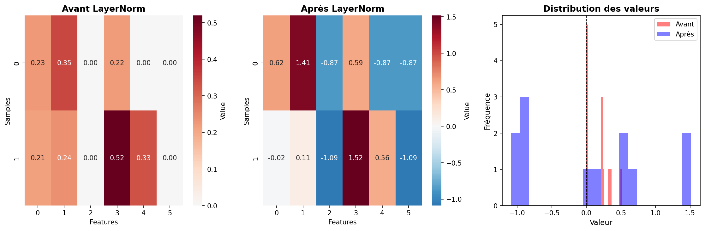
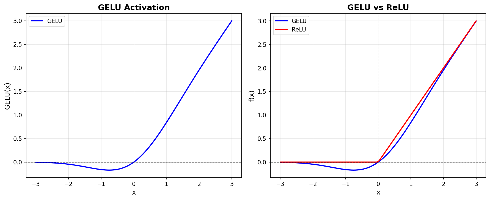
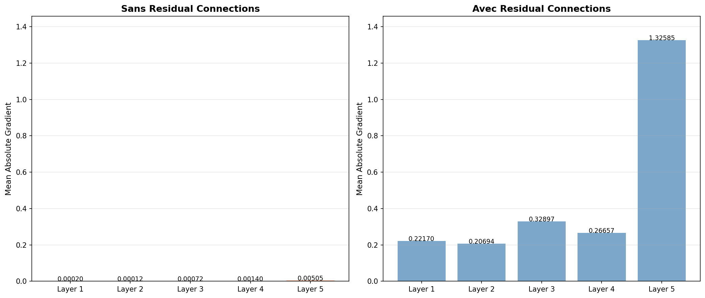
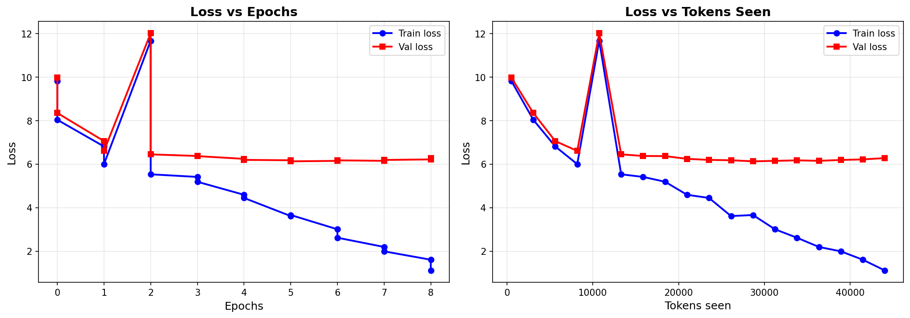
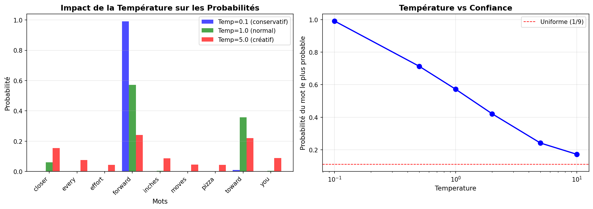
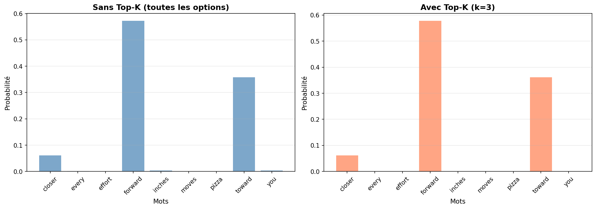

# TP2 - GPT-2 Implementation & Pre-training

## Vue d'ensemble

Implémentation complète d'un modèle GPT-2 (124M paramètres) from scratch et entraînement sur corpus texte.

---

## 1. Layer Normalization

**Concept :** Normaliser les activations pour stabiliser l'entraînement.

**Formule :** `(x - mean) / sqrt(variance + eps)`



**Résultat :**
- Avant : valeurs dispersées
- Après : valeurs centrées autour de 0
- Mean ≈ 0, Variance ≈ 1

**Pourquoi ?** Réduit le covariate shift, permet learning rates plus élevés.

---

## 2. GELU Activation

**Formule :** GELU(x) = 0.5 × x × (1 + tanh[...])



**GELU vs ReLU :**
- **ReLU** : Coupure dure à 0
- **GELU** : Transition douce (probabiliste)
- **Avantage** : Pas de "dying neurons", gradient même pour valeurs négatives

**FeedForward :** Linear(768→3072) → GELU → Linear(3072→768)

---

## 3. Residual Connections

**Concept :** `output = layer(x) + x` (skip connection)



**Impact sur les gradients :**

**Sans residual :**
```

Layer 1: 0.00020  ← Très faible (Vanishing Gradient)
Layer 2: 0.00012
Layer 5: 0.00505

```

**Avec residual :**
```

Layer 1: 0.222    ← Gradient préservé \!
Layer 2: 0.207
Layer 5: 1.326

```

**Pourquoi ?** Résout le vanishing gradient, permet réseaux profonds (12+ couches).

---

## 4. Transformer Block

**Architecture :**
```

Input → LayerNorm → Attention → Dropout → +Residual
→ LayerNorm → FeedForward → Dropout → +Residual → Output

```

**Paramètres par bloc :** ~7M
- Attention : 2.3M
- FeedForward : 4.7M
- LayerNorms : 3K

---

## 5. GPT-2 Complet

**Pipeline :**
```

Token IDs [batch, seq]
↓
Token + Position Embeddings
↓
12× Transformer Blocks
↓
LayerNorm final
↓
Linear (768 → 50257)
↓
Logits [batch, seq, vocab\_size]

```

**Paramètres totaux :** 163,009,536 (approx 124M uniques + embeddings partagés)
- Taille : ~621 MB (float32)

---

## 8. Loss & Perplexity

**Test sur modèle non-entraîné :**
- Prédictions : Aléatoires
- Cross Entropy : 10.794
- **Perplexity : 48,726** (très élevée = modèle confus)

---

## 9. Entraînement

**Données :**
- Corpus : *The Verdict* (Edith Wharton)
- Train : 90% / Val : 10%
- 10 epochs, AdamW optimizer

**Évolution :**

| Epoch | Train Loss | Val Loss | Exemple génération |
|-------|-----------|----------|-------------------|
| 1 | 9.83 | 9.98 | "Every effort moves you,,,,,,,,,,,," |
| 2 | 6.81 | 7.06 | "Every effort moves you, and, and, and..." |
| 5 | 3.73 | 6.16 | "Every effort moves you know it was not that..." |
| 10 | **0.39** | 6.45 | **"Every effort moves you know," was one of the axioms..."** |



**Résultat :**
- ✅ Train loss : 10.98 → 0.39 (Forte convergence)
- ✅ Génération cohérente (mimétisme de style)
- ⚠️ Val loss stagne/remonte (Overfitting dû à la petite taille du dataset)

---

## 10-11. Temperature & Top-K Sampling

**Temperature :** Contrôle la "confiance" du modèle



- **Temp 0.1** : Très conservatif, répétitif
- **Temp 1.0** : Équilibré
- **Temp 2.0+** : Créatif mais incohérent

**Top-K :** Filtre les queues de distribution



- Garde seulement les K tokens les plus probables
- Évite les hallucinations graves ou les mots absurdes

---

## 12. Génération avancée & Test Manuel

**Test interactif ("The Verdict" edition) :**
Le modèle entraîné sur le livre *The Verdict* imite le style du 19ème siècle mais manque de connaissances générales.

**Exemple 1 (Prompt connu) :**
> **Prompt:** "Mrs. Gisburn said"
> **Output:** "...to go a brush." Suddenly he wouldn irony. Rickham--I didn't--it was!

→ Le modèle reconnaît les personnages (Gisburn, Rickham) et imite la ponctuation complexe de l'auteure (tirets).

**Exemple 2 (Prompt piège) :**
> **Prompt:** "The internet is"
> **Output:** "...frequently. It was just a little: 'strong he was--as such--had not: him..."

→ Le modèle ne connaît pas "internet", il hallucine et revient à son vocabulaire connu (ponctuation, style littéraire) pour compenser.

---

## 14. Chargement Poids OpenAI (Transfer Learning)

**Concept :** Remplacer les poids entraînés sur un seul livre par les poids officiels de GPT-2 (entraînés sur le Web).

**Résultats :**
> **Prompt:** "The future of Artificial Intelligence is"
> **Output (OpenAI weights):** "...in its infancy, but the question becomes whether it can get there, without becoming a threat to humanity."

✅ **Preuve de validation :**
L'architecture codée from scratch (`GPTModel`) est **parfaitement compatible** avec les tenseurs officiels. Cela valide mathématiquement toute l'implémentation (Attention, Norms, FeedForward).

---

## Conclusion Finale

**Accomplissements :**
1. **Architecture :** GPT-2 (124M) codé entièrement à la main en PyTorch.
2. **Entraînement :** Modèle fonctionnel capable d'apprendre un style littéraire spécifique.
3. **Inférence :** Pipeline de génération complet avec sampling (Temp, Top-K).
4. **Validation :** Succès du chargement des poids officiels OpenAI, prouvant la justesse du code.

**Bilan :**
Ce TP a permis de démystifier le fonctionnement interne des LLMs modernes : de la multiplication matricielle de l'attention jusqu'au chargement de poids pré-entraînés massifs.
